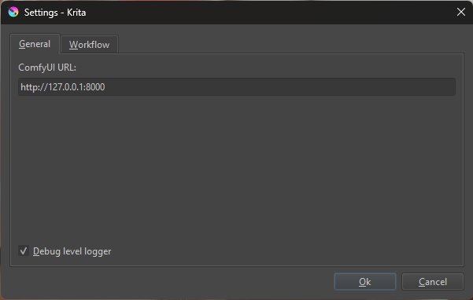
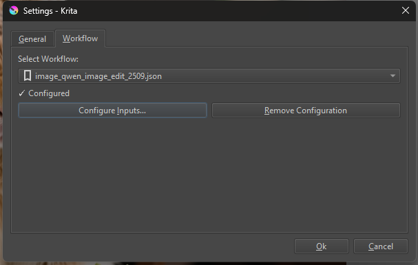
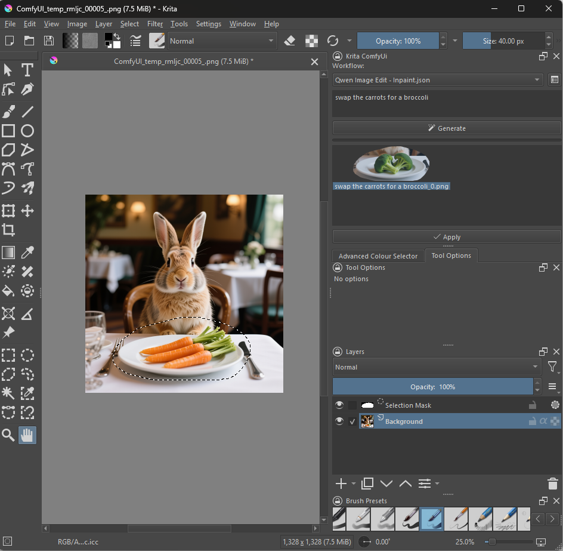
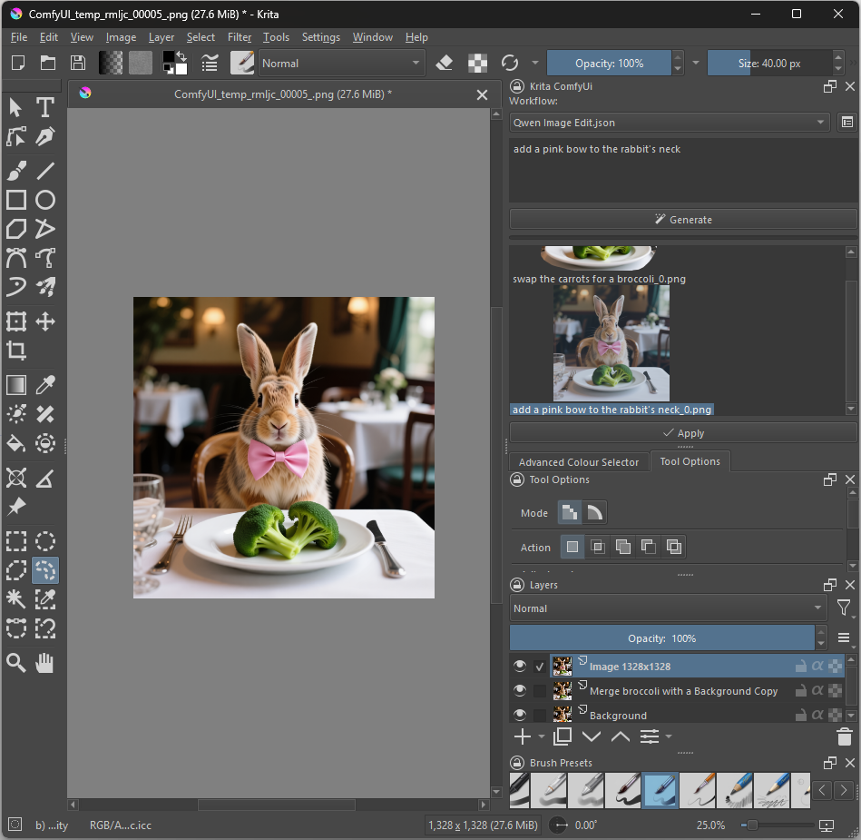

# Krita ComfyUI

**Krita ComfyUI** is a lightweight plugin for **Krita 5.2+** that lets you run **ComfyUI** workflows directly from Krita. The plugin focuses on reliable communication with the ComfyUI server; workflow design and configuration are handled by the user.

> ⚠️ **Compatibility:** Krita 5.2 or newer.
> ⚙️ **GPU:** To generate images locally you need a GPU with at least 6 GB VRAM (NVIDIA, AMD, or Apple Silicon).

---

## Features

| Feature | Description |
|---------|-------------|
| **Generate** | Run ComfyUI workflows to produce images. |
| **Prompt** | Text‑to‑image from a simple prompt dialog. |
| **Inpainting** | Use Krita selections for generative fill, expansion or object removal. |
| **History** | Browse and preview all previous generations and prompts. |
| **Configure** | Simple UI to connect to your ComfyUI server and select workflows. |
| **UI Style** | Built‑in style presets for a streamlined interface. |

---

## Getting Started

1. **Install Krita**
   - Download the latest version from [krita.org](https://krita.org).
   - Minimum version: 5.2.0.

3. **ComfyUI Server**
   The plugin does not install or run ComfyUI; it must already be running before opening Krita. You can use the official version available at [ComfyUI](https://github.com/Comfy-Org/ComfyUI).

4. **Download & Install the Plug‑in**

   | Step | Action |
   |------|--------|
   | 1 | Grab the latest release ZIP: <https://github.com/dacert/krita-comfyui/releases/latest> |
   | 2 | In Krita, go to `Tools ▸ Scripts ▸ Import Python Plugin from File…` and select the ZIP. |
   | 3 | Restart Krita. |

## Initial Setup

> 👉 If you run ComfyUI locally, start the server first before opening Krita so the plugin can detect it automatically.

1. **Show the ComfyUI Docker**: `Settings ▸ Dockers ▸ Krita ComfyUI`.

2. In the Docker window, click the settings icon and fill in the tabs:
   - **General** – Enter the server URL (e.g., `http://localhost:8000/`).
   - **Workflow** – Select a workflow and adjust its inputs.

   

## Workflow Configuration

To have the plugin list available workflows, the ComfyUI server must be online and contain them.

1. In the **Workflow** tab, select a workflow (e.g., *Qwen Image Edit.json*).
2. Adjust parameters: prompt, seed, image loading nodes, etc.
3. Use **Add/Update** to save the configuration or **Remove** to delete it.

   

## Using the Plugin

### 1. Basic Generation
- Select a workflow from the drop‑down menu.
- Enter a prompt (e.g., “a cat”).
- Click **Generate** to get the image.

### 2. Inpainting
1. Open an image and select the area to modify with any Krita selection tool.
2. Choose the *Qwen Image Edit – Inpaint.json* workflow.
3. Enter a prompt (e.g., “replace carrots with broccoli”).
4. Click **Generate** and, when satisfied, click **Apply** to insert the generated image.

   

### 3. Image Editing
- Select the area to edit.
- Choose the *Qwen Image Edit.json* workflow (or any that accepts an image input).
- Enter a descriptive prompt (e.g., “add a pink ribbon to the rabbit’s neck”).
- Generate and apply.

   

### 4. History
The plugin temporarily stores all generations made during the session. You can browse the history to preview previous results; it is lost when Krita closes.

## Supported Platforms & Hardware

| OS | GPU support |
|----|-------------|
| Windows, Linux, macOS | • NVIDIA – CUDA (Win/Linux)  • AMD – DirectML (Win; limited), ROCm (Linux)  • Apple Silicon – MPS (macOS 14+)  • CPU – Very slow  • XPU – Supported but may be slower |

**Tip:** A powerful GPU (≥6 GB VRAM) will drastically improve generation speed.
---
## Known Issues

- Workflows containing node-groups are not yet supported.  
- If you want to use a pre‑configured workflow, start ComfyUI *before* opening Krita; otherwise the plug‑in won’t load it correctly.

---

## Troubleshooting

| Problem | Possible Cause | Solution |
|---------|----------------|----------|
| Server URL not shown | ComfyUI server isn’t running or URL is incorrect | Start the server and verify the URL. |
| Workflows don’t list | Connection failed to the server | Check that the firewall allows connections to `localhost:8000` (or the configured port). |
| Plugin fails to generate images | Insufficient GPU or outdated drivers | Update your graphics card drivers and check available VRAM. |

## Contribution and Support

- **Contribute** – We welcome contributions! Please read our [contributing guide](CONTRIBUTING.md) before submitting a pull request.
- **Report bugs / questions** – Open an issue on GitHub: <https://github.com/dacert/krita-comfyui/issues>. Do not use official Krita channels for plugin support.

Happy creation! 🎨