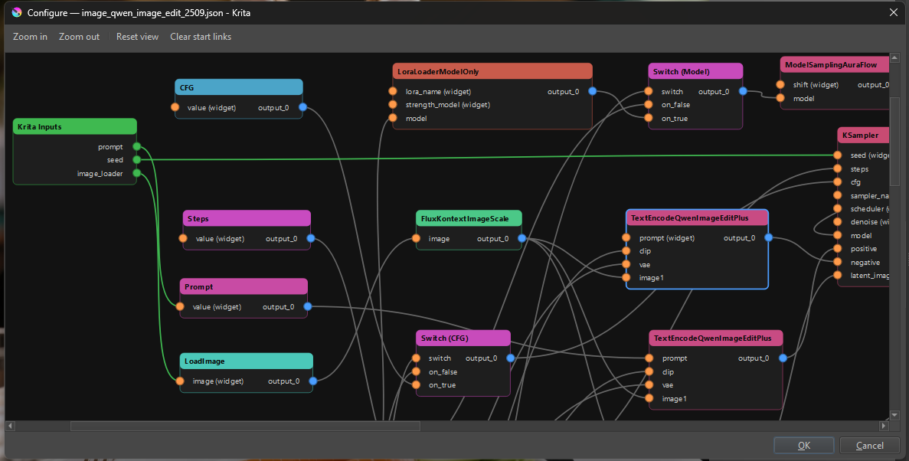

# Krita ComfyUI

**Krita ComfyUI** is a lightweight plugin for **Krita 5.2+** that lets you run **ComfyUI** workflows directly from Krita. The plugin focuses on reliable communication with the ComfyUI server; workflow design and configuration are handled by the user.

> ⚠️ **Compatibility:** Krita 5.2 or newer.
> ⚙️ **GPU:** To generate images locally you need a GPU with at least 6 GB VRAM (NVIDIA, AMD, or Apple Silicon).

---

## Features

| Feature | Description |
|---------|-------------|
| **Generate** | Run ComfyUI workflows to produce images. |
| **Prompt** | Text‑to‑image from a simple prompt dialog. |
| **Inpainting** | Use Krita selections for generative fill, expansion or object removal. |
| **History** | Preview the images generated during the current Krita session. |
| **Cloud execution** | Run workflows on ComfyUI Cloud by providing an API key. |
| **Generation timeout** | Configure how long a generation can run before being aborted. |
| **Configure** | Simple UI to connect to your ComfyUI server and select workflows. |
| **UI Style** | Built‑in style presets for a streamlined interface. |

---

## Getting Started

1. **Install Krita**
   - Download the latest version from [krita.org](https://krita.org).
   - Minimum version: 5.2.0.

3. **ComfyUI Server**
   The plugin does not install or run ComfyUI; it must already be running before opening Krita. You can use the official version available at [ComfyUI](https://github.com/Comfy-Org/ComfyUI).

4. **Download & Install the Plug‑in**

   | Step | Action |
   |------|--------|
   | 1 | Grab the latest release ZIP: <https://github.com/dacert/krita-comfyui/releases/latest> |
   | 2 | In Krita, go to `Tools ▸ Scripts ▸ Import Python Plugin from File…` and select the ZIP. |
   | 3 | Restart Krita. |

## Initial Setup

> 👉 If you run ComfyUI locally, start the server first before opening Krita so the plugin can detect it automatically.

1. **Show the ComfyUI Docker**: `Settings ▸ Dockers ▸ Krita ComfyUI`.

2. In the Docker window, click the settings icon and fill in the tabs:
   - **General**
     - **ComfyUI URL** – e.g. `http://localhost:8000/` for a local server,
       or your ComfyUI Cloud endpoint for cloud execution.
     - **API Key (optional, for ComfyUI Cloud)** – leave empty for a local
       server. When using ComfyUI Cloud, paste the API key issued by the
       cloud service; it is sent as the `X-API-Key` header (HTTP) and as a
       `token` query parameter on the WebSocket connection. The key is
       stored in plain text in `krita_comfyui.config` — protect that file
       accordingly.
     - **Generation timeout (minutes)** – maximum time a single generation
       is allowed to run (1–60, default 5). Increase it for slow workflows
       such as high‑resolution or multi‑pass pipelines.
     - **Enable clipspace uploads** – when enabled (default) the plugin
       uploads the full clipspace chain (mask, paint, painted,
       painted‑mask) before running inpainting workflows. Disable to
       upload only the base image and the selection‑reduced mask, which is
       what non‑clipspace inpaint pipelines actually consume.
   - **Workflow** – Select a workflow and adjust its inputs.

   

### Running on ComfyUI Cloud

ComfyUI Cloud lets you run workflows on hosted GPUs instead of your own
hardware. To use it from the plugin:

1. Subscribe to ComfyUI Cloud and copy your API key from the dashboard.
2. In **Settings ▸ General**, set:
   - **ComfyUI URL** to `https://cloud.comfy.org`.
   - **API Key** to the value copied in step 1.
3. Pick a workflow in the **Workflow** tab and click **Generate** as usual.

The key is stored locally in `krita_comfyui.config` and is never sent
anywhere other than to the configured ComfyUI server.

> ⚠️ **Security notice:** the API key is stored in **plain text** inside
> the local `krita_comfyui.config` file. Anyone with read access to your
> user profile can view it. Do not share that file.

## Workflow Configuration

To have the plugin list available workflows, the ComfyUI server must be online and contain them.

> ⚠️ **Critical Requirement:** Workflows **must** include a `SaveImageWebsocket` output node. This custom node is required for the plugin to receive generated images from ComfyUI. Without it, execution will fail with the error: *"No 'SaveImageWebsocket' output node found."*

1. In the **Workflow** tab, select a workflow (e.g., *image_qwen_image_edit_2509.json*).
2. Use **Configure Inputs...** to open the configuration dialog or **Remove Configuration** to delete it.

   

3. Link parameters to "Krita Inputs" node: prompt, seed, image loading nodes, etc.

   

> ⚠️ **Important:** This graph configuration dialog is read-only — it is not intended for editing workflows. Its only purpose is to link the Krita input node with the other nodes, establishing the communication interface between the plugin and the workflows.

## Using the Plugin

### 1. Basic Generation
- Select a workflow from the drop‑down menu.
- Enter a prompt (e.g., “a cat”).
- Click **Generate** to get the image.

### 2. Inpainting
1. Open an image and select the area to modify with any Krita selection tool.

   > 🧪 *Experimental:* in **Settings ▸ General**, the **Enable clipspace
   > uploads** option controls what gets uploaded for inpaint workflows.
   > Leave it on to send the full clipspace chain (mask, paint, painted,
   > painted‑mask). Turn it off to send only the base image and the mask
   > reduced by the selection — usually what plain inpaint pipelines
   > need. *This setting is experimental and does not affect the final
   > image quality; it only changes which intermediate files are
   > uploaded.*

2. Choose the *Qwen Image Edit – Inpaint.json* workflow.
3. Enter a prompt (e.g., “replace carrots with broccoli”).
4. Click **Generate** and, when satisfied, click **Apply** to insert the generated image.

   

### 3. Image Editing
- Select the area to edit.
- Choose the *Qwen Image Edit.json* workflow (or any that accepts an image input).
- Enter a descriptive prompt (e.g., “add a pink ribbon to the rabbit’s neck”).
- Generate and apply.

   

### 4. History
The plugin temporarily stores all generations made during the session. You can browse the history to preview previous results; it is lost when Krita closes.

## Supported Platforms & Hardware

| OS | GPU support |
|----|-------------|
| Windows, Linux, macOS | • NVIDIA – CUDA (Win/Linux)  • AMD – DirectML (Win; limited), ROCm (Linux)  • Apple Silicon – MPS (macOS 14+)  • CPU – Very slow  • XPU – Supported but may be slower |

**Tip:** A powerful GPU (≥6 GB VRAM) will drastically improve generation speed.
---
## Known Issues

- Workflows containing node-groups are not yet supported.  
- If you want to use a pre‑configured workflow, start ComfyUI *before* opening Krita; otherwise the plug‑in won’t load it correctly.

---

## Troubleshooting

| Problem | Possible Cause | Solution |
|---------|----------------|----------|
| Server URL not shown | ComfyUI server isn’t running or URL is incorrect | Start the server and verify the URL. |
| Workflows don’t list | Connection failed to the server | Check that the firewall allows connections to `localhost:8000` (or the configured port). |
| Plugin fails to generate images | Insufficient GPU or outdated drivers | Update your graphics card drivers and check available VRAM. |
| SaveImageWebsocket node not found | Workflow missing required output node | Add a `SaveImageWebsocket` node to your ComfyUI workflow and reconnect it to the output image pipe. |
| Cloud requests return 401/403 | Missing or invalid API key | Verify the API key in **Settings ▸ General ▸ API Key**. |
| Generation aborts with a timeout | `timeout_minutes` too low for the workflow | Raise **Generation timeout** in **Settings ▸ General**. |
| API key looks wrong / leaked | The key is saved in plain text in `krita_comfyui.config` | Rotate the key in ComfyUI Cloud and update it in **Settings ▸ General ▸ API Key**. Avoid sharing the config file. |

## Contribution and Support

- **Contribute** – We welcome contributions! Please read our [contributing guide](CONTRIBUTING.md) before submitting a pull request.
- **Report bugs / questions** – Open an issue on GitHub: <https://github.com/dacert/krita-comfyui/issues>. Do not use official Krita channels for plugin support.

Happy creation! 🎨